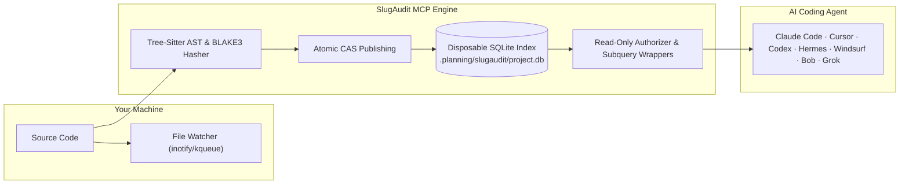

# 🐌 SlugAudit

### High-performance, zero-bloat repository intelligence for AI coding agents.

[](https://github.com/SlugThugLabs/slugaudit/releases)
[](Cargo.toml)
[%5D-emerald)](src/lib.rs)
[](tests/)
[](src/bin/check_coverage.rs)
[-purple)](https://modelcontextprotocol.io)
[](LICENSE)

> **Stop burning 80% of your AI agent's context window on repetitive file scans.**  
> SlugAudit indexes your codebase once, verifies freshness in sub-milliseconds on every keystroke, and arms your AI agent with queryable SQL and Tree-sitter AST tools. Your agent spends **zero tokens on file rediscovery** and **100% of its context on deep reasoning**.

---

## ⚡ The Problem: Why AI Code Audits Fail

When you ask an AI coding agent to inspect or audit a codebase, it typically resorts to brute force:
1. It lists directories and reads 40+ entire files looking for symbol definitions and call sites.
2. It burns **100,000+ context tokens** before writing a single line of analysis.
3. As the context window fills up, the agent hits compaction, forgets earlier files, hallucinates stale paths, and enters paranoid re-validation loops.

| Audit Metric | Without SlugAudit ❌ | With SlugAudit ⚡ |
| :--- | :--- | :--- |
| **Context Cost** | 50,000–150,000+ tokens burned reading whole files | **~400 tokens** (returns only relevant symbols & AST spans) |
| **Search Latency** | 15–60 seconds of slow disk I/O & file reading | **< 2 ms** directly from SQLite WAL & Tree-sitter |
| **Freshness Guarantee** | Stale caches; agent hallucinations on edited files | **100% Guaranteed Fresh**: Synchronous atomic reconcile on every read |
| **Safety & Integrity** | Script execution risks, unbounded write surfaces | **Hardened Read-Only**: `SQLITE_OPEN_READ_ONLY` + engine authorizers |
| **Session Isolation** | Old agent notes contaminate future runs | **Zero Contamination**: Session-scoped findings auto-purged on restart |

---

## 🏗️ How It Works

SlugAudit acts as an invisible, high-speed telemetry and evidence layer between your filesystem and your AI agent over the standard **Model Context Protocol (MCP)**:



1. **Discovery & Hash**: Respects `.gitignore` and `.ignore` recursively, walks the repo in milliseconds, and hashes files with BLAKE3.
2. **Deep AST Extraction**: Runs Tree-sitter across 300+ languages to index functions, methods, imports, call hierarchies, comments, and syntax diagnostics.
3. **Atomic CAS Publish**: Commits the entire index into an ephemeral SQLite database in `.planning/slugaudit/project.db` using compare-and-swap (CAS) concurrency control.
4. **Sub-millisecond Reconcile**: Background watcher detects file edits. Every tool call verifies freshness synchronously before returning results—zero chance of stale data.
5. **Precise SQL & AST Tools**: The AI agent queries exact facts (`files`, `evidence`, `revisions`) without ever touching the disk.

---

## 🎯 The Division of Labor

- **SlugAudit gathers facts:** indexes, extracts, synchronizes, and searches.
- **The AI does the audit:** interprets evidence, spots logic bugs, judges security implications, and refactors code.

SlugAudit does not judge code, assign arbitrary "scores", or tell your AI what to think. It provides ground truth so your AI can do real engineering.

---

## 🚀 Quick Start

### 1. Fast Install

```bash
# One-line universal installer (Linux x86_64 or builds via cargo):
curl -fsSL https://raw.githubusercontent.com/SlugThugLabs/slugaudit/main/install.sh | bash

# Or build locally from source with Cargo:
cargo install --path .

# Or run the interactive setup menu:
slugaudit menu
```

### 2. Connect Your AI Agent (One-Click)

SlugAudit automatically configures your favorite AI coding assistant:

```bash
slugaudit connect agy       # Antigravity (agy mcp add)
slugaudit connect gemini    # Gemini CLI (gemini mcp add)
slugaudit connect claude    # Claude Code (~/.claude.json)
slugaudit connect cursor    # Cursor IDE (~/.cursor/mcp.json)
slugaudit connect codex     # Codex CLI (~/.codex/config.toml)
slugaudit connect hermes    # Hermes Agent
```

*(Run `slugaudit connect` without arguments to auto-detect installed agents interactively from your terminal).*

To disconnect: `slugaudit disconnect <agent>` or pick from `slugaudit disconnect`.

### 3. Ask Your Agent Anything

Start a normal session with your agent and ask:

> *"Audit our authentication flow. Are token expiration checks enforced on every endpoint?"*

Your agent will call `report`, `query`, and `structure` in the background—answering with exact line ranges in milliseconds without flooding your context.

---

## 🔌 Supported AI Agents & Editors

| AI Client / Editor | Setup Command / Config | Scope | Status |
| :--- | :--- | :--- | :---: |
| **Antigravity (agy)** | `slugaudit connect agy` | Native CLI (`agy mcp add`) | ✅ Native |
| **Gemini CLI** | `slugaudit connect gemini` | Native CLI (`gemini mcp add`) | ✅ Native |
| **Claude Code** | `slugaudit connect claude` | Global (`~/.claude.json`) | ✅ Native |
| **Cursor** | `slugaudit connect cursor` | Global (`~/.cursor/mcp.json`) | ✅ Native |
| **Windsurf** | `slugaudit connect windsurf` | Global (`mcp_config.json`) | ✅ Native |
| **Trae AI IDE** | `slugaudit connect trae` | Global (`~/.trae/mcp.json`) | ✅ Native |
| **OpenCode** | `slugaudit connect opencode` | User config (`opencode.json`) | ✅ Native |
| **Hermes Agent** | `slugaudit connect hermes` | Global CLI (`hermes mcp add`) | ✅ Native |
| **Codex** | `slugaudit connect codex` | Global (`~/.codex/config.toml`) | ✅ Native |
| **GitHub Copilot CLI** | `slugaudit connect copilot` | Global CLI (`copilot mcp add`) | ✅ Native |
| **Bob** | `slugaudit connect bob` | Global (`--scope global`) | ✅ Native |
| **Grok** | `slugaudit connect grok` | User Scope (`~/.grok/config.toml`) | ✅ Native |
| **Zed Editor** | `slugaudit connect zed` | User settings (`settings.json`) | ✅ Native |
| **Pi / Oh My Pi** | `slugaudit connect pi` / `omp` | User config (`mcp.json`) | ✅ Native |
| **1MCP / OpenHands** | `slugaudit connect 1mcp` | Native CLI | ✅ Native |
| **Other MCP Clients**| `slugaudit menu` (Option 4) | JSON snippet for any client | ✅ Standard |

---

## 🛠️ The 7 Native MCP Tools

| Tool | Capability | Example AI Query |
| :--- | :--- | :--- |
| **`report`** | High-level project shape, file counts, language distribution, and syntax diagnostics. | `report(path: ".")` |
| **`query`** | High-speed read-only SQL queries against the indexed repository. | `SELECT f.path, e.start_line, e.payload FROM evidence e JOIN files f ON e.file_id = f.id WHERE e.kind = 'Symbol'` |
| **`structure`** | Tree-sitter AST queries across 300+ languages (supports single-file or multi-file search with lean snippets). | `structure(language: "rust", query: "(function_item name: (identifier) @fn)")` |
| **`finding`** | Store AI-reviewed conclusions bound to the file content hash. | Auto-invalidates if the underlying source lines change. |
| **`finding_read`** | Session-gated finding retrieval (prevents cross-session hallucination). | Read only findings created by the current agent. |
| **`project_control`** | Project enable/disable and cache management. | `project_control(action: "on", path: ".")` |
| **`health`** | Real-time watcher status, sync latency (`last_sync_duration_ms`), and counters. | Operational snapshot without side effects. |

---

## ⚡ Performance Benchmarks

Measured on standard development hardware (AMD Ryzen 9 / Linux kernel 6.x):

| Operation | Benchmark / Metric | Latency / RSS |
| :--- | :--- | :---: |
| **Repository Discovery** | Walk & BLAKE3 hash 200 files | **4.2 ms** |
| **Cold Tree-Sitter AST Parse** | Full syntax extraction (Rust grammar) | **370 µs** |
| **SQL Query Latency** | General query + subquery authorizer | **< 1.0 ms** |
| **Incremental Reconcile** | Hot reload dirty file on keystroke | **< 8.0 ms** |
| **Memory Footprint** | Peak RSS during heavy repository sync | **26.9 MiB** |
| **Code Safety** | Crate-wide `#![forbid(unsafe_code)]` | **0 unsafe blocks** |

---

## 📖 Query Cookbook & Recipes

Ready-to-run queries for AI agents and security auditors in [`examples/queries/`](examples/queries/):

- **[Auth Attack Surface](examples/queries/auth_attack_surface.sql)**: Map all authentication, token, and session endpoints in < 2ms.
- **[Find Unhandled Panics](examples/queries/find_unhandled_panics.sql)**: Pinpoint crash-prone `.unwrap()`, `.expect()`, and `panic!()` calls.
- **[Syntax Diagnostics](examples/queries/syntax_diagnostics.sql)**: Extract parser errors and syntax issues without running a compiler.
- **[Rust AST Matcher](examples/queries/rust_functions.scm)**: Tree-sitter query matching exact function shapes and parameter blocks.

---

## Product boundary

The single end-user product is the `slugaudit` binary. Users install and
configure it with their AI agent, and the binary operates on the user's own
projects.

For each enabled user project, SlugAudit owns only this derived-data directory:

```text
<user-project>/.planning/slugaudit/project.db
```

The surrounding `.planning/` directory belongs to the user's project workflow.
Its other files are ordinary user project data and may be indexed normally.
SlugAudit excludes its own `.planning/slugaudit/` directory from discovery.

The database is disposable derived data — delete it and any tool call
rebuilds it from source.

## Repository scope

See [DEVELOPMENT_SCOPE.md](DEVELOPMENT_SCOPE.md) for the distinction between
this repository's development materials and the runtime behavior of SlugAudit
inside a user's project.

## Repository Structure & The `.planning/` Directory

All architectural blueprints, design decisions, and runtime index data live inside `.planning/`:

- **Source of Truth**: [`.planning/ARCHITECTURE.md`](.planning/ARCHITECTURE.md) is the canonical, authoritative source of truth for the codebase. It details the complete module map, data flow, process lifecycle, security boundaries, and the 10 core architectural invariants governing SlugAudit.
- **Design & Planning History**: [`.planning/archive/`](.planning/archive/) preserves historical planning records, architectural decision logs, and dependency inventories.
- **Disposable Runtime Cache**: `.planning/slugaudit/project.db` houses the SQLite index and evidence tables. This is derived data that SlugAudit automatically creates and synchronizes—it can be deleted at any time and any tool call will rebuild it from source.

Keeping these artifacts organized inside `.planning/` keeps the repository root uncluttered while providing both human developers and AI coding agents a dedicated, structured home for all architecture and design documentation.

## Documentation

- **[Architecture](.planning/ARCHITECTURE.md)** — the authoritative architectural specification (module map, data flow, security model, design FAQ)
- **[Connection guides](docs/)** — agent-specific setup for Bob, Claude Code, Grok, and Codex
- **[Archive](.planning/archive/)** — historical planning docs, decision log, dependency inventory

## Development

Requires Rust 1.97.1+ (edition 2024) on Linux or macOS. Run the same gates CI uses:

```bash
cargo fmt --all -- --check
cargo clippy --all-targets --all-features -- -D warnings
cargo test --lib --bins --tests --all-features
cargo run --quiet --bin check_source_limits --locked
cargo run --quiet --bin check_docs_drift --locked
cargo run --quiet --bin check_no_duplicates --locked
```

`#![forbid(unsafe_code)]` is enforced crate-wide. Zero unsafe in `src/`.

### Structured Logging

Diagnostics log to `stderr` with ANSI colors disabled by default. For automated log aggregators (e.g. Datadog, Grafana Loki, CloudWatch), set:

```bash
export SLUGAUDIT_LOG_FORMAT=json
```

All `stderr` events will be formatted as single-line JSON while `stdout` remains strictly JSON-RPC.

## License

SlugAudit is **free to use** — including for your own commercial software.
Use it to develop, audit, test, and maintain whatever you build, and you may
sell the software you create with it. Software you make using SlugAudit (and
the results it produces) does not become subject to SlugAudit's license just
because the tool was used.
The only thing you need to contact us about (`admin@slugthuglabs.dev`) is
distributing **SlugAudit itself** — for example embedding, bundling,
redistributing, sublicensing, or selling the tool as part of another product
or service. That includes a company wanting to make SlugAudit a branded part
of something they sell — we'd love to talk. Internal team and dev use is
always free.

See the complete [LICENSE](LICENSE) for the binding terms.
